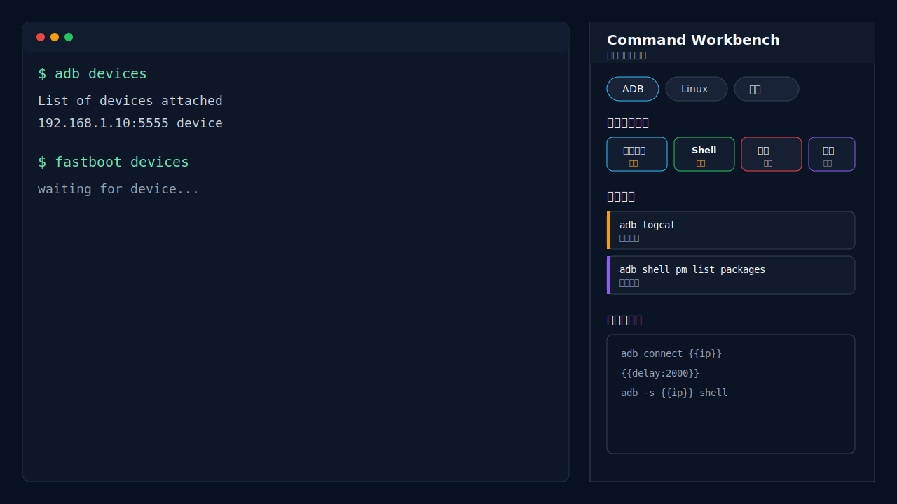

# Tabby Command Workbench

[](https://github.com/rookie0422/tabby-command-workbench/actions/workflows/ci.yml)
[](https://www.npmjs.com/package/tabby-command-workbench)
[](LICENSE)

一个用于 Tabby 的右侧命令工作台，适合把串口、ADB、Linux、Claude 等调试场景里的高频命令整理成可复用按钮、常用命令和持久草稿。



## 核心功能

- 按场景组织命令：每个场景都有自己的快捷按钮、常用命令和草稿区。
- 场景 Tab、快捷按钮和常用命令支持拖动排序，顺序自动持久化。
- 快捷按钮支持填充、复制、直接发送并回车。
- 快捷按钮支持 `{{name}}` 参数占位符，点击时填写参数并复用到整段按钮内容。
- 快捷按钮在直接执行模式下支持多行顺序发送，可用 `{{delay:2000}}` 或 `{{delay:2s}}` 插入简单等待。
- 编辑快捷按钮时可一键插入参数占位符和 delay 片段；插入 delay 会自动启用直接执行。
- 常用命令左键复制，右键可填充或发送。
- 草稿区按场景持久保存，适合暂存调试片段、日志、备注和待复制文本。
- 侧栏可拖动调整宽度，并随 Tabby 配置持久化。

## 安装

在 Tabby 的 `Settings -> Plugins` 中搜索并安装：

```text
tabby-command-workbench
```

安装后重启 Tabby。

也可以在 Tabby 插件目录中安装：

```bash
npm install tabby-command-workbench
```

常见插件目录：

- Windows: `%APPDATA%\tabby\plugins`
- macOS: `~/Library/Application Support/tabby/plugins`
- Linux: `~/.config/tabby/plugins`

## 平台兼容性

插件基于 Tabby 插件 API 实现，设计上适用于 Windows、macOS 和 Linux。当前主要在 Windows 上进行日常验证；macOS 和 Linux 用户如果遇到布局、快捷键或终端粘贴行为差异，欢迎反馈 issue。

不同平台、Shell 和终端前端对多行粘贴、快捷键拦截和终端焦点的处理可能略有差异。

## 使用

- 左键场景 Tab：切换场景。
- 拖动场景 Tab：调整场景顺序。
- 拖动快捷按钮：在三列或四列网格中跨行、跨列调整顺序。
- 拖动常用命令：上下调整命令顺序。
- 左键快捷按钮：执行该按钮配置的默认行为。
- 左键常用命令：复制命令正文。
- 右键场景、快捷按钮或常用命令：新增、编辑、删除、复制、填充或发送。
- 草稿区：自由粘贴、编辑、选择和复制文本。
- `Esc`：从草稿区返回当前终端。

参数化快捷按钮示例：

```text
adb connect {{ip}}
{{delay:2000}}
adb -s {{ip}} shell
```

点击该按钮时会先填写 `ip`，再按顺序发送两条命令，中间等待 2 秒。`delay` 只按时间等待，不判断上一条命令是否成功。

`{{delay:...}}` 只在快捷按钮勾选“填充后自动回车（直接执行）”时生效；编辑器里插入 delay 会自动启用直接执行。

## 安全提示

快捷按钮、常用命令和草稿区内容会持久化到 Tabby 配置文件中。不要在本插件中保存 token、密码、生产密钥或其他敏感凭据。

会直接发送并回车的按钮在界面上有独立标记；命中高风险命令时，保存或首次执行需要确认。

## 迁移

从 `tabby-serial-command-sidebar` 升级时，首次启动会自动迁移原有分类、按钮、常用命令和草稿内容。确认新版本正常后即可卸载旧包。
